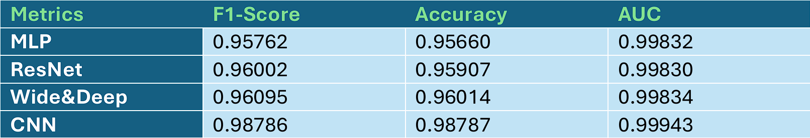
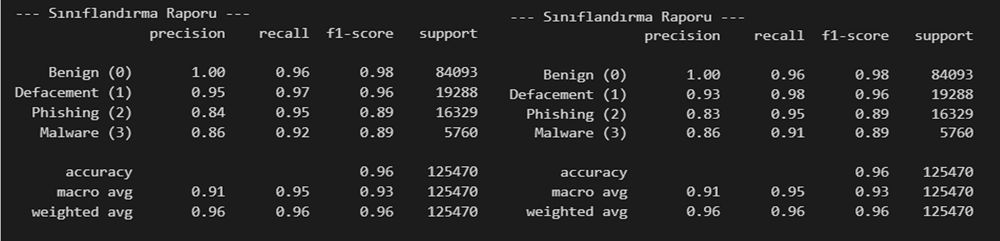
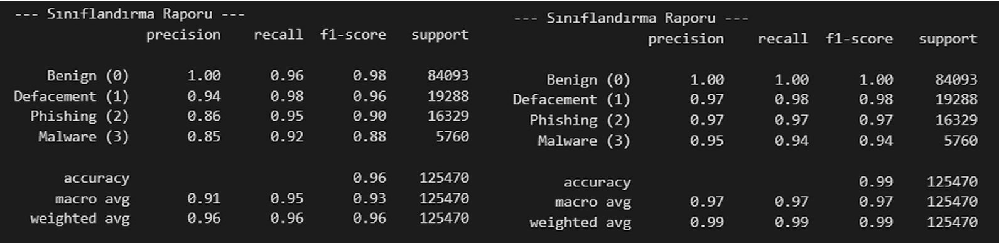
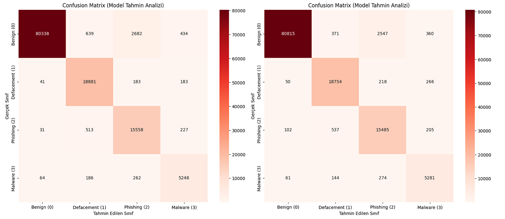
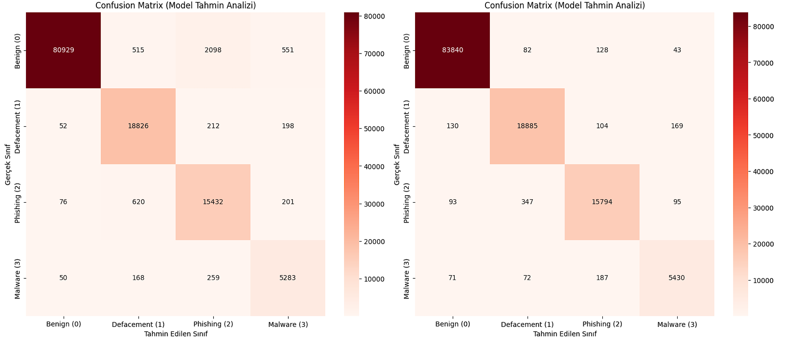
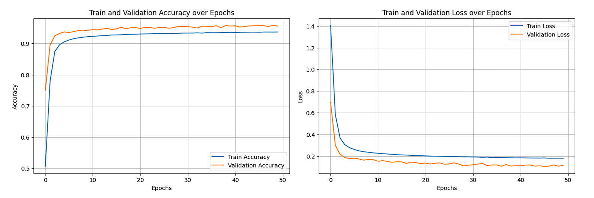
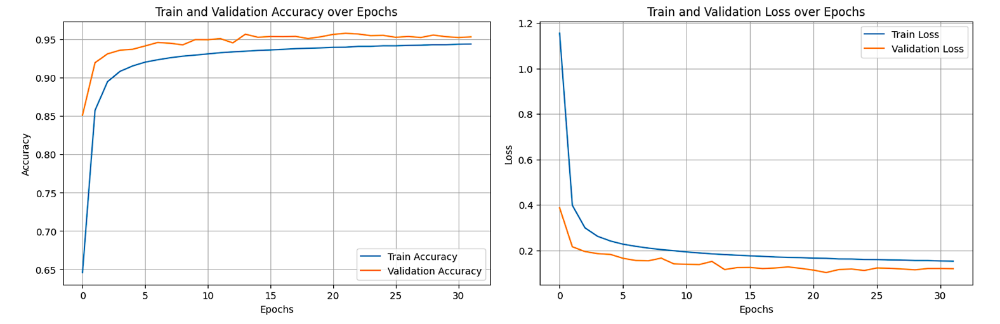
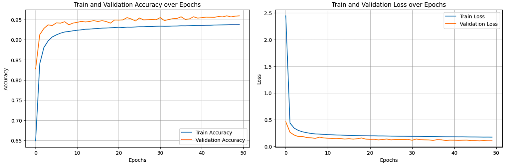

# URL_Prediction_With_Deep_Learning_Methods
This project purpose is predict the malicious URLs with deep learning methods and compare those models.

# Material and Method 
Purpose of this study is predict the URLs that has malicious features such as 
defacement, phishing and malware. Dataset obtained from online dataset platform 
Kaggle. Kfold technique applied to the dataset while training of the model. Dataset 
splitted %80 training and %20 test data. 4 machine learning algorithms used for training 
the dataset. Those are CNN, MLP, ResNet, Wide&Deep algorithms.

# Dataset 
Malicious URL Detection Dataset obtained from Kaggle. Malicious URL Detection 
Dataset contains 651,000  sample and includes 4 labels, those are benign (428,103), 
defacement (96,457), phishing (93,920) and malware (32,520). It has 65 columns. While 
the data processing dataset already splitted %80 training and %20 test and those 
percents change after the Kfold applied, the last percents are %64 training, %16 
validation, %20 test. Columns gives the informations about such as URL length , URL’s 
characters, and some informations about URL web status. 

# Machine Algorithm Methods 
Appropriately selected 4 machine learning methods with regard to the dataset 
structure. Those are MLP, ResNet, Wide&Deep, CNN algorithms.

# Preprocessing  
Preprocessing is a very essential section, and this section directly affects model 
performance. Mistakes like data leakage in the preprocessing section cause misleading 
performance in model metrics. Hence, in this study test and train split was the first step 
of the preprocessing section just for giving more attention to data leakage. Therefore, 
all preprocessing and feature extraction processes are applied to each dataset 
separately. 
Dataset has 4 labels and most of it is benign url and least url is malware. Malware type 
of url approximately %5 of dataset. Therefore, during the split of train test and there is 
high possibility of not obtaining malware type in test dataset. Hence, the stratify 
parameter applied to train_test_split function. This parameter provides secure 
percentages of all types while train_test_split. 
Drop to some columns would increase the model training time. Therefore, some 
columns dropped after using them and extract some informations. Those columns are 
url, type, scan_date and some extracted scan_date features.  
Last steps of the preprocessing sections are about shuffling the rows places and drop 
to duplicated rows. Those processes are also beneficial for the model performance. 

# Feature Extraction 
In this section, purpose is produce to more efficient columns from already exist 
columns. Those produced columns would increase the model performance but avoid 
extraction of the frivolous columns, and research to logical columns for better 
performance is key to this section. 
Special characters features were settled columns separately in dataset. Reduce 
unnecessary columns in dataset would reduce model training time. Because of this 
situation, separated special characters in each column summed in each row and 
inserted the new special_characters column. 
Column named “url” given in its raw version in dataset. In this case, “url” column is the 
most important column for feature extraction. Because it is obviously visibly, most of 
the malicious URLs have an abnormal structure. This abnormality could be length, 
quantity of special characters or another thing. Hence, feature like path_deep, 
path_underscore, has_index_php and has_option_param extracted from “url” column. 
Is_path_deep  column extracted from path_deep column. 
Columns named "year", "month", "day", "hour", "minute", "second" extracted from 
“scan_date” column. After the several tests showed “year”, “month” and “day” 
artificially inflates model performance. Therefore, those columns dropped and 
remaining columns were normalized.

# Results 
While the model training section, 5-dimensional Kfold applied to the model training 
code and results come from the best model. Each model performance on F1-score, 
accuracy and AUC metrics given in table 1.

Table 1. Results of each Model on F1-score, Accuracy and AUC metrics

It is obviously visibly in table 2, MLP, ResNet, Wide&Deep algorithms have close 
results, but CNN has performed approximately %2 more successful on F1-score and 
Accuracy metrics. Hence, that is demonstrate CNN is quite better than another 
algorithms.

Table 2. Table on right shows classification report of MLP and table on left classification report of ResNet

Table 3. Table on right shows classification report of CNN and table on left classification report of Wide&Deep

One important thing is also how models are performed on classification of malware 
type. As seen in table 2 and table 3 CNN have almost perfect results.

Figure 1. Left one confusion matrix of MLP, right one confusion matrix of ResNet

Figure 2. Left one confusion matrix of Wide&Deep, right one confusion matrix CNN

After the demonstration of Figure 1 and Figure 2 CNN has quite better performance and 
other algorithms are close to each other on their performance. 

Figure 3. MLP algorithm performance accuracy over epochs and loss over epochs

Figure 4. ResNet algorithm performance accuracy over epochs and loss over epochs

Figure 5. Wide&Deep algorithm performance accuracy over epochs and loss over

Figure 6. CNN algorithm performance accuracy over epochs and loss over epochs

Those graphs show MLP, ResNet and Wide&Deep algorithms graphs more stable, and 
CNN has obviously fluctuated graphs. In this case, Dataset was a tabular dataset and 
MLP, ResNet and Wide&Deep algorithms more stable on this type of dataset. Hence, 
CNN has fluctuated graph, and others have visually better and stable graphs.

